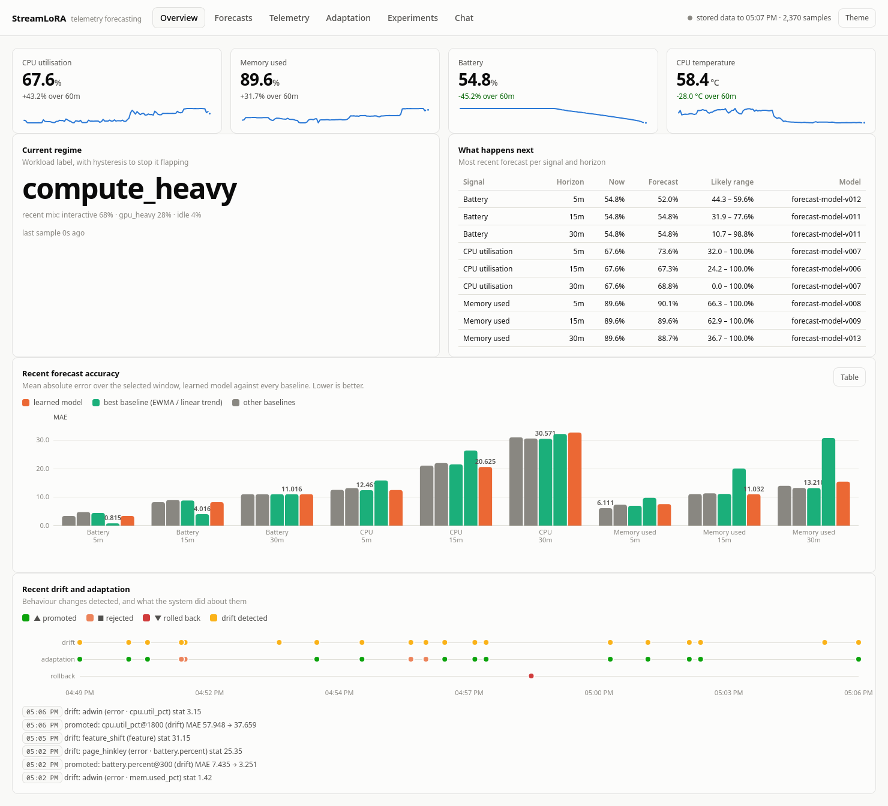
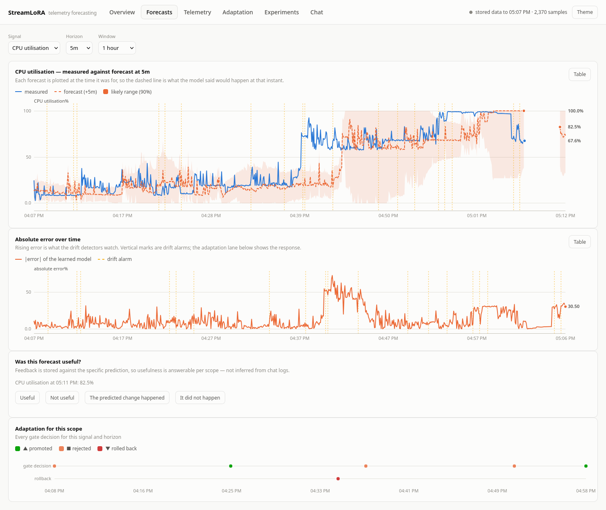

# StreamLoRA

A continuous learning and forecasting system for personal computer telemetry.

> [!NOTE]
> **Work in progress.** StreamLoRA runs end to end today: collection, forecasting, drift
> detection, gated adaptation with rollback, the dashboard and the grounded language layer.
> It isn't finished, though. There is still work to do, and the real-telemetry results rest on
> 3.3 hours of data from one machine. [Limitations](#limitations) lists what the current
> results do and don't support.

StreamLoRA samples your laptop's sensors, learns how *your* machine behaves,
predicts what it will do next, measures whether those predictions were any good,
notices when the machine starts behaving differently, and updates itself
incrementally — keeping a versioned, auditable trail of every change and rolling
back the ones that turn out worse.

It also explains itself in English, grounded strictly in recorded measurements.

```
sensors ─► normalise ─► feature window ─► forecast ─┬─► prediction + interval
                                                     │
   actual arrives ─► resolve ─► error ─► drift? ─────┴─► adapt ─► gate ─► promote
                                                                      └─► rollback
```

---

## Why this is not a dashboard with a model bolted on

Three commitments shape the whole design.

**Baselines are the point, not a formality.** On telemetry, "do nothing" is a
strong forecaster — CPU utilisation is close to a random walk at five minutes,
and battery discharge is nearly linear. Every learned forecast is reported
against persistence, moving average, EWMA and linear extrapolation, computed on
the identical inputs at the identical instants. Several of the results below are
losses. They are reported as losses.

**Evaluation is chronological, always.** Nothing is ever shuffled. Training rows
whose *target* time falls inside the next segment are embargoed, because a
feature window at time *t* has already seen data that a naive split would put in
the test set.

**The language layer cannot invent a number.** Facts are assembled from SQLite
with no model involved; a model is then asked to phrase them, and the result is
checked against the evidence. An answer containing a number that is not in the
evidence is discarded and the deterministic answer is served instead.

---

## What it measures, on real hardware

Collected from my laptop:
**38 signals from 8 sources at 5 s**, ~45 ms per tick. The recorded dataset is
3.3 hours and includes a 27-minute unplugged discharge under load (battery
100% → 55%).

| | |
|---|---|
| Sources | CPU, memory, battery (sysfs + psutil), thermal, NVIDIA GPU (NVML), disk, network, process attribution |
| Forecast targets | CPU %, memory %, battery % (configurable) |
| Horizons | +5 min, +15 min, +30 min (configurable) |
| Replay speed | ~450× real time |
| Storage | one SQLite file |

Battery is read from `charge_now / charge_full` rather than the integer
`capacity` file, because a 1% quantum turns a realistic 0.15 %/min drain into a
staircase with seven-minute treads and makes short-horizon slope estimation
impossible.

---

## Headline results

### Does continual adaptation beat a static model?

Yes, clearly. Same estimator, same data, same held-out tail; the only difference
is whether learning continues past the training boundary.

**On synthetic drift scenarios, online beats static on 34 of 45 scopes, worse on
5.** On 3.3 h of real telemetry it is 3–3 — see the caveat below the table.

| scenario | scope | static MAE | best online MAE | online vs static |
|---|---|---|---|---|
| idle → build | cpu@5m | 10.52 | 5.87 | **+44.2%** |
| idle → build | mem@15m | 4.32 | 2.45 | **+43.2%** |
| idle → build | cpu@15m | 22.70 | 14.43 | **+36.4%** |
| discharge → charge | battery@5m | 3.32 | 1.95 | **+41.2%** |
| gappy idle | cpu@30m | 3.35 | 2.45 | +26.7% |
| permanent regime change | cpu@5m | 11.37 | 9.28 | +18.4% |

The exception is instructive. On `spike_burst` — a *stationary* process, the same
spike pattern repeating for five hours — the static model wins (cpu@5m: 3.70
static vs 4.35 online, −17.7%). When the world genuinely is not changing,
adaptation only adds variance. That is the right answer, and it is why the
drift-triggered policy exists.

**On real telemetry the result is much weaker: 3 scopes better, 3 worse.**
Adaptation wins clearly at mem@5m (+24.9%) and loses at mem@30m (−15.1%). The
most likely reason is that 3.3 hours is not enough for the online arm to
accumulate an advantage, and this recording's one large regime change — the
charger coming out — sits close to the train/test split. The synthetic result
shows the mechanism works when behaviour genuinely shifts; the real-data result
shows how much telemetry it takes to demonstrate that, and this is not enough.

### Does the learned model beat the baselines?

**Sometimes, and it depends entirely on the signal.** This is the honest answer.

| dataset | scope | best baseline | learned | verdict |
|---|---|---|---|---|
| spike_burst (structured) | cpu@5m | 4.51 (persistence) | **3.70** | **+18%** — learned wins |
| **real laptop** | mem@30m | 10.81 (moving avg) | **10.11** | **+6.5%** — learned wins |
| **real laptop** | mem@15m | 9.14 (persistence) | **8.72** | **+4.6%** — learned wins |
| idle → build | cpu@5m | 6.14 (EWMA) | **5.87** | **+4.4%** — learned wins |
| **real laptop** | cpu@15m | 14.95 (EWMA) | **14.64** | **+2.1%** — learned wins |
| real laptop | cpu@5m | 9.39 (EWMA) | 9.66 | −2.9% — EWMA wins |
| **real laptop** | battery@5m | **0.48** (linear trend) | 1.97 | −310% — the physics baseline wins outright |

Three things follow, and all three are stated in `docs/experiments.md`:

1. On real telemetry the learned model takes **4 of 8 comparable scopes**, with
   modest margins (+2% to +6.5%). It wins at the 15- and 30-minute horizons and
   loses at 5 minutes, where the signal is closest to a random walk.
2. **EWMA and moving average are very strong baselines** on smooth signals and
   frequently win. A project that omitted them would have reported a false
   success.
3. **Linear extrapolation dominates battery** — now confirmed on a real
   100% → 55% discharge, not just in simulation. State of charge is the integral
   of power draw; extrapolating the observed rate is close to optimal, and
   nothing here improved on it.

### Do the intervals mean anything?

Adaptive conformal intervals reach **90.1% empirical coverage against a nominal
90%** on stationary noise, and recover to 89.9% within a few hundred samples of a
6× variance shift. Coverage degrades at long horizons on short runs (0.69 at
+5 min vs 0.39 at +15 min on 1.5 h of real data) — the pool is simply too small
there, and the dashboard shows it rather than hiding it.

### Do the safety mechanisms fire?

They do, on real data. Across the four arms of the real-telemetry experiment
(3.3 h): **306 promotions, 132 rejections, 35 rollbacks**. Rejections split into
84 `hard_reject_worse` and 48 `worse_than_tolerance` — the gate is doing work, not
rubber-stamping. A representative rollback from the event log:

```
rolled back: battery.percent@900 (regression_watch)  MAE 6.088 → 18.487
```

A version passed the promotion gate on 120 held-out samples, was 3× worse in
production, and was reverted automatically.

## Quick start

```bash
git clone https://github.com/aimsotrash/streamlora.git && cd streamlora
python3 -m venv .venv && .venv/bin/pip install -e '.[dev]'

.venv/bin/streamlora doctor      # what can this machine actually measure?
.venv/bin/streamlora serve       # dashboard on http://127.0.0.1:8765
```

`serve` starts collecting immediately. Nothing leaves the machine.

Optional extras:

```bash
pip install -e '.[lora]'   # the language adaptation layer (torch + peft)
pip install nvidia-ml-py   # NVML: 0.02 ms GPU reads instead of 45 ms via nvidia-smi
```

### Without waiting for hours of telemetry

```bash
streamlora scenarios
streamlora replay scenario:idle_to_build --minutes 180
streamlora eval
```

### The experiments

```bash
# Does adaptation beat a static model? (the core question)
streamlora experiment --dataset scenario:permanent_regime_change --suite core

# What is the safety machinery worth? What about the trust region?
streamlora experiment --dataset scenario:idle_to_build --suite safety
streamlora experiment --dataset scenario:idle_to_build --suite design

# Everything, on every scenario
bash scripts/run_synthetic_suite.sh data/exp_synthetic 300 core

# On your own recorded telemetry
streamlora collect --minutes 240 --forecast
streamlora export data/mine.jsonl
streamlora experiment --dataset file:data/mine.jsonl --suite core
```

### The language layer

```bash
streamlora ask "Why is my CPU usage rising?"       # works with no model installed
streamlora feedback label --text "That happens when I'm compiling. Normal for me."

streamlora lora build-data --examples 400
streamlora lora compare        # base vs prompt vs few-shot vs LoRA vs full fine-tune
```

---

## The dashboard

Six views, each answering one question.

| view | question |
|---|---|
| Overview | What is my machine doing, and what happens next? |
| Forecasts | Is the forecast tracking reality, and where does it fail? |
| Telemetry | What has the machine been doing? |
| Adaptation | What did the system learn, and did it help? |
| Experiments | Does the learned model beat the baselines? |
| Chat | Grounded questions about the telemetry |



The forecast view plots each prediction at the time it was *for*, so the dashed
line is what the model claimed would happen at that instant — with its
uncertainty band, drift alarms, and the gate decisions underneath.



Charts are hand-rolled SVG: no build step, no CDN, nothing fetched from a third
party by a page that displays your telemetry.

---

## How it works

| stage | choice | why |
|---|---|---|
| Storage | SQLite, long-format readings | Single writer at 0.2 Hz on one machine. Long format makes "add GPU temperature later" a zero-migration change. |
| Forecaster | Recursive least squares | Exactly equal to batch ridge when the forgetting factor is 1 (verified to 1e-15), so *static* and *continually adapted* are the **same estimator** and the measured gap is attributable to adaptation rather than to two unrelated architectures. |
| Target | Volatility-normalised change, baselines as inputs | Zero weights reproduce persistence exactly, and one unit coefficient reproduces any baseline, so ridge shrinkage degrades the model toward a real forecast instead of toward nonsense. |
| Uncertainty | Adaptive conformal | Distribution-free, and its guarantee survives the model changing underneath it — which continual learning does by construction. |
| Drift | Page-Hinkley + ADWIN + feature shift | Error-based detectors catch degradation; the feature detector catches the change before errors accumulate. |
| Safety | Chronological gate + regression watch | The gate uses ~120 held-out samples; the watch re-checks in production and rolls back what the gate let through. |
| Language | Evidence pack → model → verifier | Numbers exist only in the evidence pack. Ungrounded output is refused, not shipped. |

Full detail in [docs/architecture.md](docs/architecture.md).

---

## Testing

```bash
.venv/bin/pytest -q                 # 240 passed, 1 skipped
.venv/bin/pytest -q -m "not lora"   # 232 passed — no torch/peft needed
```

The suite is not decoration — it caught most of the bugs listed below. It
includes the five scenarios the design calls for (idle→workload,
discharge→charge, sudden spike, permanent behaviour change, dropouts and gaps),
asserts that two replays of the same dataset produce **identical predictions and
identical adaptation decisions**, and verifies that a failing sensor never stops
the others.

---

## What went wrong on the way here

Recorded because the dead ends are the interesting part, and each is now a
regression test.

- **The promotion gate ratcheted downward.** A 2% tolerance per adaptation, over
  ~200 adaptations, compounds to (1.02)^200 ≈ 50×. Skill was negative on every
  scope until the tolerance was set to zero.
- **The trust region silently never engaged.** The adaptation controller trained
  *cloned* regressors and bypassed the method that fed the uncertainty pool, so
  the trust region was active in offline fits and dead in production. Fixing it
  moved cpu@5m from 14.76 to 9.32; the ablation now shows it is worth 1.8–2.9×.
- **Version numbers stalled.** `next_version` counted rows, pruning deleted them,
  so every promotion reissued `v012` and rollback ping-ponged between two
  identical labels.
- **Ridge crushed the informative features.** Battery's slope feature has
  magnitude ~1e-3; its contribution to the information matrix was 400× smaller
  than the ridge penalty. Fixed by expressing the target in units of the
  signal's current volatility.
- **A plain Hoeffding bound is wrong for unbounded data.** ADWIN produced a false
  alarm every ~180 samples on pure noise until the variance-aware ADWIN2 bound
  replaced it. Now: zero false alarms in 9,000 stationary samples.
- **A perfectly-predicted signal broke drift detection.** Zero warm-up variance,
  floored at 1e-6, turned a 1e-4 error into a 100-sigma event. The floor is now
  set in error units.
- **`--data-dir` was silently ignored.** argparse merges subparser results into
  the same namespace, so the subcommand's default overwrote the value given
  before it.
- **Replays were not reproducible across processes.** The training buffer's seed
  came from `hash(scope)`, which Python salts per interpreter. The in-process
  determinism test passed happily; two runs of the same experiment quietly
  produced different models. There is now a test that runs each replay in its own
  subprocess with different `PYTHONHASHSEED` values.
- **An explanation was grounded but wrong.** "CPU utilisation is 62.9%. In 5 min
  it is predicted at 99.5%" — where 99.5% was the *battery* forecast. Every
  number was in the evidence, so the groundedness check passed; the sentence was
  simply about two signals. Attribution is now enforced structurally, because a
  numeric containment check cannot catch it.
- **A result that looked like a catastrophe was a sample-size artefact.** One arm
  reported battery@30m MAE of 43.99 against 6.53 for the others. It had 7
  resolved predictions to their 1198, all seven straddling the charger unplug.
  The tables now print per-arm sample ranges and refuse to compute a percentage
  when counts differ by more than 2×.
- **My own hypothesis was wrong, twice.** I predicted that shrinking only the
  telemetry-derived block of the model would beat shrinking everything — measured,
  it lost 4 of 6 scopes. And I expected the baseline-stacking inputs to matter a
  lot; they are worth under 1% on most scopes. The trust region is what matters.

## Limitations

Stated plainly, because several of them bound what the results mean.

- **3.3 h of real telemetry from one machine.** Enough to show the pipeline works
  end to end and to confirm the battery finding on a real 100% → 55% discharge,
  but far too little to see diurnal structure — which is exactly what the
  time-of-day features exist to exploit. It is also why online-vs-static is only
  3–3 on real data against 34–5 on synthetic drift scenarios.
- **Synthetic scenarios are not evidence about accuracy.** They are generated by
  a process with known structure, so any model that recovers it looks good. They
  are used for correctness, determinism and edge cases.
- **The language experiment's targets are machine-rendered** from an explicit
  persona, not written by a human. It measures whether an adaptation mechanism
  can acquire a *specified* style-and-grounding function and at what cost — not
  whether people prefer the output.
- **Groundedness is a numeric-containment check.** It catches invented
  measurements; it cannot catch a fluent sentence that misreads a correct number.
- **Interval coverage is a long-run average**, not conditional. Intervals are too
  wide when calm and too narrow just after a regime change.
- **The linear model is genuinely limited.** It cannot express "CPU will spike
  when the build finishes linking". Gradient-boosted trees or a small sequence
  model would likely do better; neither updates incrementally without either
  replay-based retraining or catastrophic forgetting, which is the trade this
  project is about.
- **Regime labels are threshold rules**, seeded not learned. They are evaluated
  per-regime so a useless label is visible, but they are not discovered.
- **The system does not automatically serve the best arm per scope.** It reports
  which arm wins for each (signal, horizon) — including where a baseline beats
  the learned model — but switching automatically would need its own hysteresis
  and evaluation, and is listed as future work rather than claimed.

---

## Documentation

Start with [docs/](docs/README.md), or go straight to one:

| | |
|---|---|
| [docs/architecture.md](docs/architecture.md) | Components, data flow, the decisions and their rationale |
| [docs/experiments.md](docs/experiments.md) | Methodology, every result, and how to reproduce them |
| [docs/research_questions.md](docs/research_questions.md) | The questions, and what the measurements answered |
| [docs/telemetry.md](docs/telemetry.md) | Signal schema, sources, adding a new one |
| [docs/limitations.md](docs/limitations.md) | What these results do and do not support |

## Privacy

Telemetry never leaves the machine. There is no cloud dependency in any path.
The process source aggregates into coarse categories and **never stores process
names or command lines**; `streamlora collect --set collect.process_attribution=false`
removes it entirely. Retention is an explicit operation, not a background job.

## Licence

MIT.
